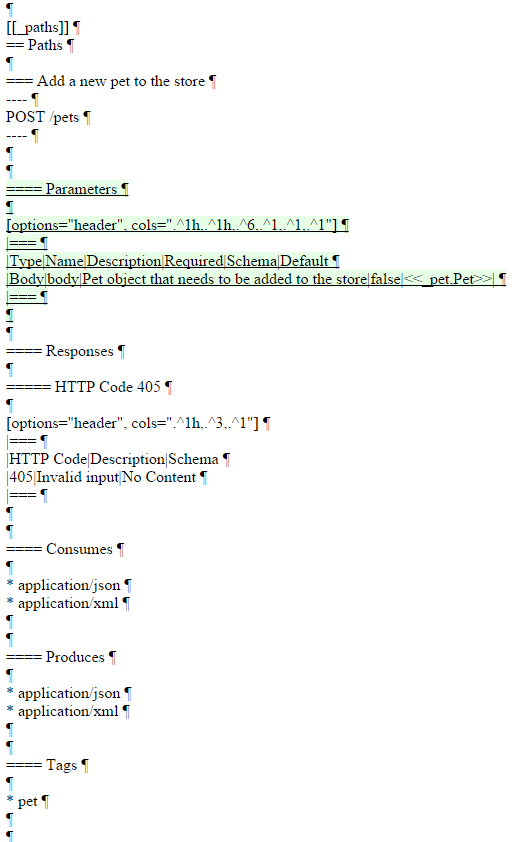

= assertj-diff
:author: Robert Winkler
:version: 0.1.1
:hardbreaks:

image:https://travis-ci.org/RobWin/assertj-diff.svg?branch=master["Build Status", link="https://travis-ci.org/RobWin/assertj-diff"] image:https://api.bintray.com/packages/robwin/maven/assertj-diff/images/download.svg[link="https://bintray.com/robwin/maven/assertj-diff/_latestVersion"] image:http://img.shields.io/badge/license-ASF2-blue.svg["Apache License 2", link="http://www.apache.org/licenses/LICENSE-2.0.txt"] image:https://img.shields.io/badge/Twitter-rbrtwnklr-blue.svg["Twitter", link="https://twitter.com/rbrtwnklr"]

== Overview

This library provides AssertJ assertions for diffing files. If a test fails, it generates an HTML report.
It uses https://github.com/sksamuel/google-diff-match-patch[google-diff-match-patch] to do the hard stuff.

The project requires at least JDK 7.

=== Usage
=== Adding assertj-diff to your project
The project is published in JCenter and Maven Central.

==== Maven

[source,xml, subs="specialcharacters,attributes"]
----
<repositories>
    <repository>
        <snapshots>
            <enabled>false</enabled>
        </snapshots>
        <id>central</id>
        <name>bintray</name>
        <url>http://jcenter.bintray.com</url>
    </repository>
</repositories>

<dependency>
    <groupId>io.github.robwin</groupId>
    <artifactId>assertj-diff</artifactId>
    <version>{version}</version>
</dependency>
----

==== Gradle

[source,groovy, subs="attributes"]
----
repositories {
    jcenter()
}

compile "io.github.robwin:assertj-diff:{version}"
----

=== Using assertj-diff

You can compare two files by providing the path to the actual file and to the expected file.

[source,java]
----
Path actualFile = Paths.get(DiffAssertTest.class.getResource("/actualFile.txt").toURI());
Path expectedFile = Paths.get(DiffAssertTest.class.getResource("/expectedFile.txt").toURI());
Path reportPath = Paths.get("build/diff-result.txt");

DiffAssertions.assertThat(actualFilePath).isEqualTo(expectedFilePath, reportPath)
----

If the test fails, assertj-diff generates a HTML into the given reportPath.

==== Report Example

== License

Copyright 2016 Robert Winkler

Licensed under the Apache License, Version 2.0 (the "License"); you may not use this file except in compliance with the License. You may obtain a copy of the License at

    http://www.apache.org/licenses/LICENSE-2.0

Unless required by applicable law or agreed to in writing, software distributed under the License is distributed on an "AS IS" BASIS, WITHOUT WARRANTIES OR CONDITIONS OF ANY KIND, either express or implied. See the License for the specific language governing permissions and limitations under the License.

